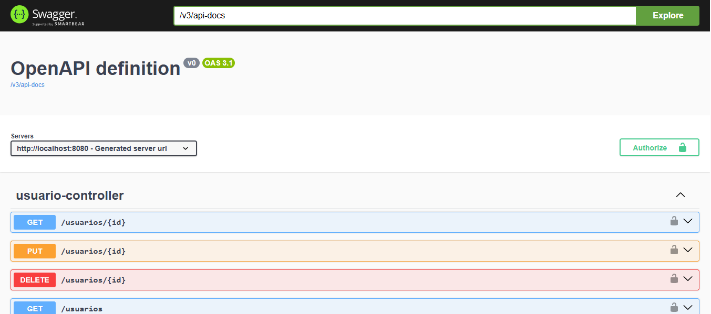
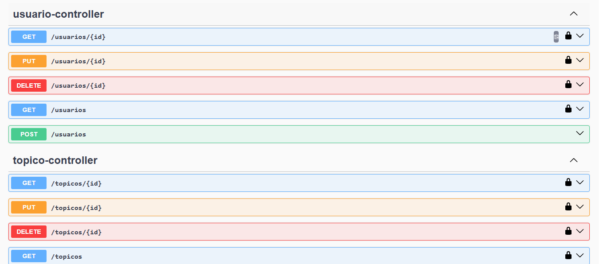
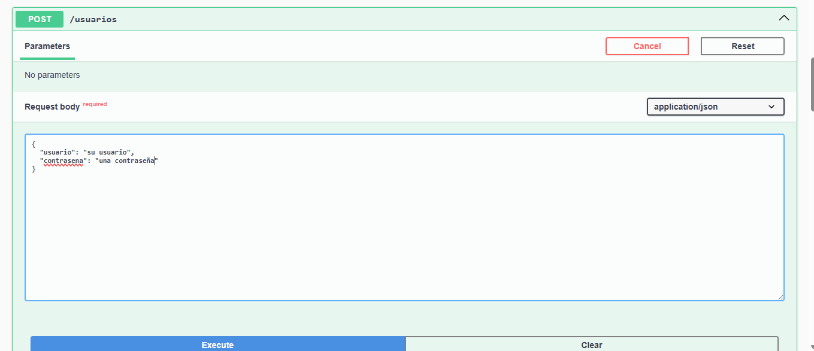
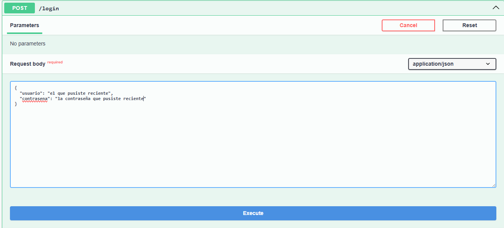
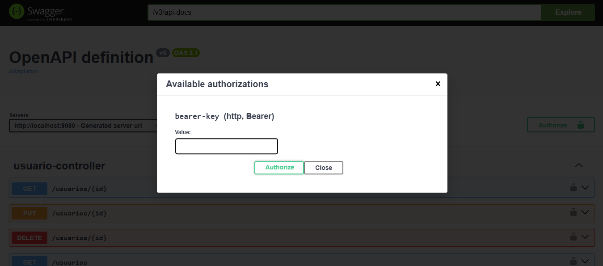

# 📚 ForoHub

ForoHub es una API REST desarrollada con **Spring Boot** que permite gestionar un foro de discusión.  
Incluye autenticación con **JWT**, manejo de usuarios, tópicos y respuestas, junto con funcionalidades de búsqueda, paginación y filtrado.

---

## 🚀 Características principales

- **Autenticación y autorización** con JWT.
- **Gestión de usuarios**: registro, actualización, listado, detallado y eliminación.
- **Gestión de tópicos**: creación, actualización, listado con paginación, Top 10, detallado, filtrado por curso y año,  y eliminación.
- **Gestión de respuestas**: registro, actualización, listado, detallado y eliminacion de respuestas asociadas a un tópico.
- **Ordenamiento y paginación** usando `@PageableDefault`.

---

## 🛠️ Tecnologías usadas

- **Java 17+**
- **Spring Boot 3**
- **Spring Data JPA**
- **Spring Security + JWT**
- **Hibernate**
- **MySQL**
- **Maven**
- **Lombok**

---

## 📦 Instalación

### 1️⃣ Clonar el repositorio
```bash
git clone https://github.com/EdsonCasta/ForoHub.git
```
## 2️⃣ Configurar la base de datos

Crea una base de datos en MySQL:
```bash
CREATE DATABASE foro_hub;
```

## 3️⃣ Configurar application.properties

Edita el archivo src/main/resources/application.properties y agrega tus credenciales:
```bash
spring.application.name=foroHub

# Configuración DB
spring.datasource.url=jdbc:mysql://localhost:3306/foro_hub
spring.datasource.username="usuario de la base de datos"
spring.datasource.password="clave de la base de datos"
spring.datasource.driver-class-name=com.mysql.cj.jdbc.Driver

# JPA / Hibernate
spring.jpa.hibernate.ddl-auto=update
spring.jpa.show-sql=true
spring.jpa.properties.hibernate.format_sql=true
spring.jpa.database-platform=org.hibernate.dialect.MySQLDialect

foroHub.security.token.secret=${JWT_SECRET:"clave"}
```

## 4️⃣ Instalar dependencias

Si es la primera vez que clonas el proyecto, instala todas las dependencias con:

```bash
mvn clean install
```

## 5️⃣ Ejecutar la aplicación

🔹 Opción 1: Desde la terminal (Maven)

```bash
mvn spring-boot:run
```
🔹 Opción 2: Desde IntelliJ IDEA

1. Abre el proyecto en IntelliJ IDEA.

2. Espera a que descargue las dependencias de Maven.

3. En el panel lateral, busca la clase principal:

```bash
src/main/java/com/alura/foroHub/ForoHubApplication.java
```

4. Haz clic derecho sobre el archivo y selecciona:

```bash
Run 'ForoHubApplication'
```

5. La aplicación se iniciará y podrás verla corriendo en:

```bash
http://localhost:8080
```

## 📂 Estructura del proyecto

```bash
src/
├── main/
│   ├── java/com/alura/foroHub/
│   │   ├── controller/   # Controladores REST
│   │   ├── model/        # Entidades JPA
│   │   ├── repository/   # Repositorios JPA
│   │   ├── service/      # Lógica de negocio
│   │   └── ForoHubApplication.java  # Clase principal
│   └── resources/
│       ├── application.properties   # Configuración
│       └── static/ / templates/     # Archivos estáticos
└── test/   # Pruebas unitarias y de integración
```

# 📖 Uso de la API con Swagger UI

ForoHub incluye **Swagger UI** para que puedas probar todos los endpoints de la API directamente desde el navegador, sin necesidad de herramientas externas como Postman o Insomnia.

---

1. Abre tu navegador y dirígete a:

```bash
http://localhost:8080/swagger-ui/index.html
```



## 🔹 Autenticarse en Swagger UI (JWT)

La API está protegida con JWT **(JSON Web Tokens)**.
Antes de probar los endpoints privados en **Swagger UI**, necesitas autenticarte y configurar tu token.



### Pasos para autenticarse:

1. En **Swagger UI**, despliega la sección usuario-controller y selecciona el endpoint **POST /usuarios**.
   Haz clic en **Try it out** para crear un nuevo usuario.



2. Haz clic en Execute para enviar la petición.

3. Luego, en la sección autenticacion-controller, despliega el endpoint **POST /login**.
   Haz clic en **Try it out**, ingresa las credenciales del usuario creado y ejecuta la petición.



4. Haz clic en Execute para enviar la petición.

5. Copia el token JWT recibido en la respuesta.

6. En la parte superior derecha de Swagger UI, haz clic en el botón **Authorize**. 



7. Pega el token en el cuadro de autorización y haz clic en Authorize.
   Finalmente, cierra la ventana con Close.

✅ ¡Listo! Ahora ya puedes consumir las rutas privadas de la API directamente desde Swagger UI.
Explora los endpoints de **usuarios**, **tópicos** y **respuestas** sin necesidad de herramientas externas 🚀.

## 🧑‍💻 Autor

Proyecto desarrollado por **Edson Castañeda**

- 📧 Email: dedsoncasta07@gmail.com
- 🔗 GitHub: [EdsonCasta](https://github.com/EdsonCasta)
- 💼 LinkedIn: [Edson Castañeda](https://www.linkedin.com/in/edsoncasta%C3%B1eda/)  
